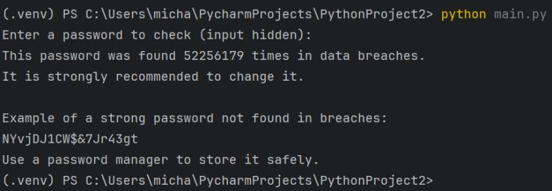

# Password Breach Checker

A Python security tool that checks whether a password has appeared in known data breaches,
using a privacy-preserving k-anonymity approach with the Have I Been Pwned (HIBP) API.
The tool can also generate strong password suggestions that were not found in known breaches.

## Key Features
- Checks passwords against the HIBP database without sending the password or full hash
- Uses SHA-1 hashing and prefix-based k-anonymity
- Hides password input in the terminal
- Handles network timeouts and API errors gracefully
- Generates strong, cryptographically secure password suggestions
- Verifies that suggested passwords were not found in known breaches

## How It Works
1. The password is hashed locally using SHA-1.
2. Only the first 5 characters of the hash (prefix) are sent to the HIBP API.
3. The API returns a list of hash suffixes and breach counts.
4. The full hash is never sent over the network.
5. The tool checks locally whether the suffix appears in the response.

This approach ensures that sensitive data is never exposed to the external service.

## Usage
Run the program from a terminal:

```bash
python main.py
